// Copyright 2012 Aaron Ecay

// This work is licensed under a Creative Commons
// Attribution-NonCommercial-NoDerivs 3.0 Unported License
// http://creativecommons.org/licenses/by-nc-nd/3.0/deed.en_US

// License to be changed to something less restrictive once this is
// release-ready (either CC-BY-SA or CC-BY-SA-NC)

// Include the file with author info, and use our custom configuration:
//   a2x: --asciidoc-opts="-f user.conf -a docinfo"
// Include the default stylesheet and our customizations:
//   a2x: --stylesheet="docbook-xsl.css annotald-manual.css"
// Highlight source in output (TODO(post-1.0): not working)
//   a2x: --xsltproc-opts "--stringparam highlight.source 1"

// Notes to contributors:
// Please add yourself to the user-docinfo.xml file and the copyright
// line (unless you wish to assign copyright to your contributions to
// the other authors)
// In addition to standard Asciidoc formatting, the following
// conventions are used in this file:
// - text which corresponds to the contents of a parse (.psd file)
//   should be surrounded with =equals signs=

// TODO: document context menu groups better

= Annotald User’s Guide

== Introduction

This manual is designed to teach users how to use the Annotald program
for annotating parsed corpora according to (a version of) the Penn
treebank standards.  This version of the manual accompanies version
*1.3.10* of Annotald.

// TODO: our labgroup docs/updates (incorp. latter into this doc?)

// TODO(post-1.0): this paragraph isn’t really applicable yet.
// In that vein, it consists of both documentation relating to the
// configuration and use of Annotald, as well as instruction on the
// application of the Penn treebank standards to corpus data.  For
// simplicity, the annotation examples in this guide will be based on
// modern English.  The principles illustrated should be applicable to
// annotation in all languages, however.

Annotald was originally written as part of the
http://www.linguist.is/icelandic_treebank/Icelandic_Parsed_Historical_Corpus_%28IcePaHC%29[Icelandic
Parsed Historical Corpus] (IcePaHC) project.  Development of the program
has been funded by:

- The Icelandic Research Fund (RANNÍS)
- The US’s National Science Foundation
- The University of Iceland Research Fund
- Research funds at the University of Pennsylvania

Annotald is under active development.  If you would like to be on a
mailing list to receive announcements of new releases, please contact
mailto:ecay@sas.upenn.edu[Aaron Ecay]

// eventually: availability of annotation seminars etc.

== Installation

In order to use Annotald, it is necessary to install several programs
that Annotald depends on in order to function.  Like Annotald itself,
all of these programs are Free Software.footnote:[There are two meanings
of the term “Free Software.”  The first refers to the software being
provided free of charge.  The second means that the software’s source
code is freely available to its users for them to inspect, modify, and
reuse.  The second of these definitions is the most important to
ensuring scientific openness; as it happens Annotald and its
dependencies fulfill both definitions.  For more information, consult
https://www.gnu.org/philosophy/free-sw.html[this document from the Free
Software Foundation].]

Some of Annotald’s dependencies may require a C compiler; for Macs this is
available by installing Apple’s no-cost XCode toolkit, and then choosing
to download the “Command Line Tools” from the “Downloads” preference pane
within the XCode application.  These are the instructions to install
Annotald on Mac and Linux:

1. Download and install the latest stable version of
   https://www.google.com/intl/en/chrome/browser/?hl=en&lr=all[Google’s
   Chrome web browser]

2. Install the latest stable version of Python 2.7, if necessary.  At
   the http://www.python.org/download/[Python download page], be sure to
   select one of the 2.7 versions of Python, not 2.6 or 3.x.  Macintosh
   computers have a sufficient version of Python pre-installed, as of OS
   X 10.7.  (If you use Linux, it is also very likely that Python 2.7 is
   already installed on your computer.)
+
In a pinch, you can use Python 2.6 to run Annotald, but some advanced
features may not be functional.

3. Follow the
   https://pip.readthedocs.org/en/latest/installing.html[instructions]
   to install the `pip` command on your computer.  The `ez_setup.py` and
   `get-pip.py` scripts you will need to download can be placed anywhere
   on your computer (for example in your Downloads folder).  They are
   one-time use scripts and can be deleted after use.

4. Open a terminal on your computer, and type `pip install annotald` .
   You may need to use `sudo` or an equivalent in order to gain
   administrative privileges needed to write the files to the proper
   location.
+
NOTE: If you do not have administrator privileges on your machine,
you can install using the command `pip install --user annotald` .
The consequence of this is that the `annotald` script will be placed
in a hidden subdirectory of your home folder (on Linux, this is
`/home/<username>/.local/bin/`); you will have to add this directory
to your `$PATH` in order to use Annotald conveniently.
+
CAUTION: During the installation process, you may see an error
message stating “libyaml not found.”  This is *not* a fatal error!  If
the `pip` command ends with the line “Successfully installed annotald
[...]” then the installation has been successful.

5. Annotald and its dependencies will now be automatically installed.
+
TIP: Annotald may be installed to a folder which is not in your shell’s
`$PATH`.  The most common destination is `/usr/local/bin`.  If this is
the case, you will need to add the directory to your path, following for
example
http://askubuntu.com/questions/60218/how-to-add-a-directory-to-my-path/60219#60219[these
directions].

Once this is done, Annotald is ready to use.  At a terminal command
prompt, type `annotald path/to/file.psd` (supplying the path to a file
in the Penn treebank format; if a sample file is needed you can use
https://raw.github.com/antonkarl/icecorpus/6ad3006cc004aefdcbdda99c188d02afa9cbe7d0/finished/1150.firstgrammar.sci-lin.psd[this
file from the IcePaHC project]).  Then, open the Chrome browser, and
navigate to http://localhost:8080.  You should see the Annotald
interface appear.  The rest of this manual is concerned with using and
customizing the program.

[CAUTION]
=====
A bug in the CherryPy webserver package has emerged recently
which will cause new installations of Annotald to fail to start with an
error message saying `No module named wsgiserver2`.  If this occurs,
execute the following commands in your shell:

----
pip uninstall Cherrypy
pip install --no-use-wheel CherryPy
----

Prepend `sudo` to the commands or add the `--user` flag after
`(un)install` as appropriate, depending on which method you used to
install Annotald originally.  Details about this bug are available
https://bitbucket.org/cherrypy/cherrypy/issue/1295/325-wheel-does-not-include-wsgiserver2py[from
the CherryPy project].
=====

NOTE: If you are not able to install Annotald successfully, you can open
an issue report at https://github.com/Annotald/annotald[Annotald’s
website] on GitHub.  This will put you in touch with Annotald’s
developers, who will help you solve the problem.  When creating issue
reports, please try to describe your computer’s configuration and the
error message you received in terms that are as accurate and concise as
possible.

In the near future, it is likely that there will be a graphical
frontend for Windows users, including a graphical installation method.
Pay attention to forthcoming releases of Annotald for news.

=== Using Annotald on a remote server

If you cannot install Annotald locally (or otherwise feel motivated to
do so), you can use Annotald on a server to which you have ssh access.
In order to do so, you will need to follow these instructions:

1. Upload the files you wish to annotate to the server.  One good way to
do this is to use SFTP, either from the command line or using a
https://en.wikipedia.org/wiki/Comparison_of_FTP_client_software[graphical
client].

2. Open an SSH tunnel from your computer to the remote computer.  This
is done with the `ssh` command line program: `ssh -L 1234:localhost:8080
user@server` .  This command makes port 1234 on your computer behave as
though it were port 8080 on `server`.
+
NOTE: You will need to adjust the number 8080 to match the port that you
attached Annotald to on the server.  8080 is the default port.  However,
only one instance of Annotald can be connected to a single port.  Thus
if there are many users of Annotald on the server you will need to
specify an alternate port using the <<port-option,-p command line
option>>
+
In addition to establishing the tunnel, this will give you a command
prompt on the remote server as usual.

3. Start Annotald from the server command line as usual.

4. Connect to Annotald by navigating Chrome on your local computer to
http://localhost:1234 (or whichever port number you specified in the
`ssh` command line).

WARNING: The instance of Annotald you start on the remote server will be
accessible to other users on the server, who can (in principle) connect
to the running server using their own SSH tunnel just as you can.  If
you do not trust the other users on the SSH server, you should not be
running Annotald on it.  Accidents are also a danger.  Be careful that
you do not inadvertently connect to someone else’s instance of Annotald!
You may inadvertently save over their work.

== Annotald UI and Philosophy

The Annotald user interface (UI) is shown in the following
screenshot:footnote:[You may notice subtle differences in some
screenshots, reflecting ways in which the Annotald UI has evolved over
its development.  It is hoped that these will not detract from the
points being explicated.]

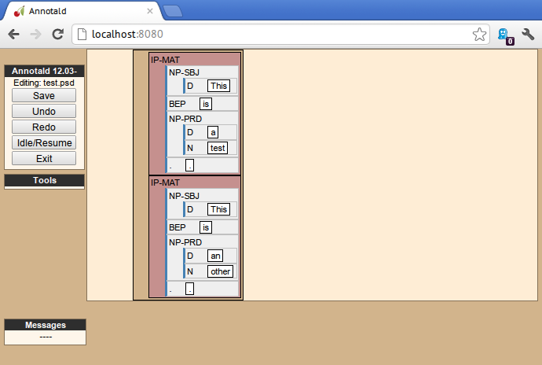

On the left-hand side of the screen, the following are present, from top
to bottom:

- The control panel.  This contains buttons for functions such as
  saving, undo/redo, and clocking in/out from a timelog file.
- The tools panel.  Empty in this screenshot, this contains advanced
  functionality when enabled, such as external validation.
- The messages pane.  This area displays messages from the
  program to the user.

Various Annotald functions involve showing a dialog box to the user.
For example, the following image demonstrates the message history dialog
(accessed by clicking “Messages” above the message area).  To dismiss a
dialog, press the escape key.  (Different dialogs may also display
buttons allowing you to close them).

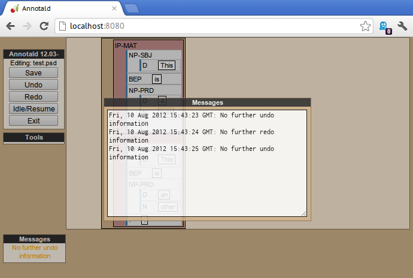

The right-hand portion of the screen is devoted to showing the contents
of the file being edited.  The tree structure of the annotation is
represented as a series of concentric boxes.  Clauses are highlighted in
dark pink, in order to make them more salient, and provide an additional visual
reference to the structure of the sentences being edited.  The box which
represents the file itself is dark brown.

Annotald aims to make common tasks in annotation nearly effortless.
Thus, complex behaviors can be executed with a single keystroke – often
without using modifier keys.  Conversely, Annotald tries to prevent
users from doing things that would be deleterious to the project of
efficiently annotating a corpus.  Thus, it is impossible to change the
text of the file itself in Annotald.  It is also difficult to edit
POS tags directly in Annotald’s interface.  Annotald is optimized for
editing a corpus which already contains mostly-accurate POS
annotation and at least some syntactic structure.  Users with corpora
that need extensive POS correction may be better served (at present) by
another tool.

There are three ways of interacting with Annotald’s user interface.

=== Mouse

It is recommended that Annotald users have a full-sized mouse with at least
two buttons.  Because of Annotald’s heavy reliance on mousing, neither a
laptop trackpad nor a single-button mouse will prove satisfactory from an
ergonomic point of view.

The mouse serves to select nodes in the UI.  Click anywhere in the box
corresponding to a node in order to select it.  The horizontal mouse
motion necessary can be reduced by clicking on the left edge of the
node; the left side of each node’s box is padded in order to facilitate
this.  An example of a selected node is shown here, notice that the
selected node has been highlighted in blue:

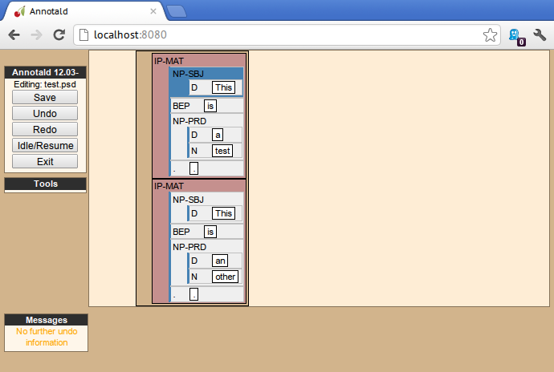

Up to two nodes may be selected at a time.  If a node is selected,
clicking another node will also highlight that node:

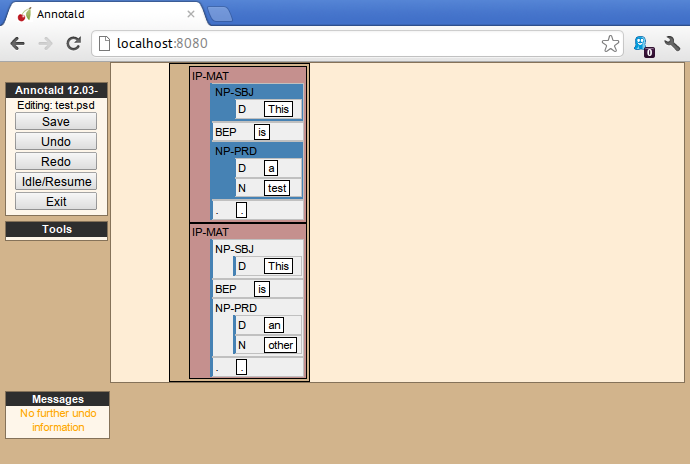

Further clicks after two nodes are selected will de-highlight the
previous second selection, and highlight the clicked node.  To clear any
selection in effect, use the space bar.

Selected nodes form the basis for many <<keycmds,keyboard commands>>.
Node selection is also the basis of movement commands, of a certain
type.  The mouse is used for movement commands that edit the structure
of the tree.  In order to annotate movement in the sense of linguistic
movement (wh-movement, etc.), see the <<leafAfter,`leafAfter`>> and
<<leafBefore,`leafBefore`>> functions.

In order to move a selected node, right click on the desired
destination.  Movements must satisfy certain structural conditions
(e.g. a node cannot be moved into its own daughter) as well as extrinsic
conditions (no movement operation may change the text of the sentence,
e.g. by reordering two words).  Assuming these conditions are met, the
movement operation will take place.  Right clicking with two selected
nodes will move those nodes, as well as any intervening material, to the
desired destination.  The two selected nodes must be sisters of each
other.

NOTE: Moving an empty category (for example a trace) behaves
interestingly, since it is not treated as part of the file’s text by
Annotald.  This allows some interesting and confusing movement
possibilities.  Thus, moving empty categories (traces beginning with
=*=, empty nodes which are =0=, and =CODE= nodes) by default is not
allowed.  However, moving a non-terminal dominating only such a
node(s) is.  So if you need to move an empty node in a pinch, just
create an XP dominating it, do your movement operation, and delete
the XP.  Do not be upset though if this procedure results in interesting
behavior (you can always use undo to get back to a sensible structure).

Control-clicking on a node will create and select a new XP dominating
that node.

// TODO(post-1.0): mouse wheel...document, or remove the code

=== Context menu

Right-clicking a node when no selection is present will summon the
context menu, which is illustrated here:

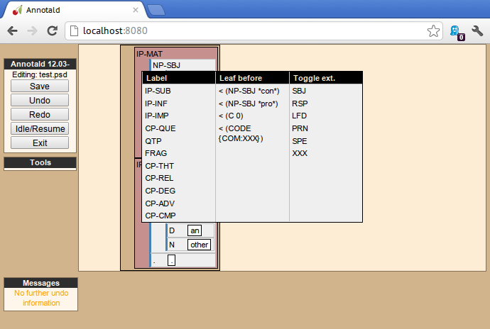

The context menu has three columns.  The first has suggested label
changes for the node; clicking any of these will change the node’s label
to the chosen option.  The second contains options for adding a sister
before the node; clicking any of these will insert a node with the given
label and text.  The third column contains options for toggling certain
dash tags.

// TODO(post-1.0): split context menu dash tags from all dash tags in config file

The context menu can be dismissed by left-clicking outside of it.

=== Keyboard

Annotald operations other than movement are controlled by the keyboard.
Annotald users should keep their right hand on the mouse at all times;
thus, only keys on the left hand side of the keyboard are used as key
shortcuts (with a small number of exceptions for commands which require
full keyboard use).footnote:[Left handed users may wish to use the left
hand for mousing and the right hand for the keyboard, but the principle
of using one hand exclusively for each operation remains the same.
Additionally, the default configuration will have to be adjusted for
users of non-English keyboard layouts.]

Generally speaking, Annotald key commands perform annotation operations
related to a single goal.  One key, for example, toggles between the
tags for different kinds of argument NPs.  For more on <<keycmds,the
default keybindings>>, including their organizing principles, or on
<<customkeys,customizing the key commands to fit your annotation
needs>>, see the linked sections.

== Customization

[[cmdline-opts]]
=== Command line options

When invoked via the command line, there are several options which can
be passed to Annotald to affect its behavior.  These are:

`-s PATH`:: Specify the path to the <<jssettings,javascript settings
file>>.  If this is not specified, the default settings file distributed
with Annotald is used.

`-S PATH`:: Specify the path to the <<pythonsettings,python settings
file>>.  If this is not specified, the default settings file distributed
with Annotald is used.

`-p NUMBER` [[port-option]]:: Specify the port which Annotald will run its server.  The
default is 8080 (possible values range between 1025 and 65535).  Only
one program may listen to a given port, so if you would like to run more
than one instance of Annotald concurrently, you must specify a different
port for each of them.  The port is sepcified in the Chrome browser
after `localhost:`.  Thus, the default URL for Annotald is
http://localhost:8080.  If you have started Annotald with the `-p 8081`
option, you should use http://localhost:8081 as the URL in the browser.

`-o`:: Specify that the file to be read from is a CorpusSearch output
file.  CorpusSearch comments will be stripped from the file on reading.

`-q` [[cmdline-q]]:: Deactivate the <<timelog,time-logging function>>.

`-n NUMBER`:: Show only NUMBER trees of the file at a time, as
described <<limiteddisplay,below>>.

`-1`:: A shortcut which is equivalent to `-n 1`

=== Settings files

There are two files which are relavant to the customization of Annotald:
`settings.js` and `settings.py`.  The former is written in Javascript,
and contains the bulk of Annotald’s user interface settings.  The latter
is written in Python, and (generally speaking) contains customizations
that are very pervasive or advanced.  A basic version of both files is
included in the Annotald package.

In order to customize these files, the user should first extract a copy
thereof.  An auxiliary script is provided for this purpose.  Execute the
following commands in your OS shell to obtain copies of each of these
files:
........
$ annotald-aux cat-settings-js > my-settings.js
$ annotald-aux cat-settings-py > my-settings.py
........
You can now edit the files `my-settings.js` and `my-settings.py`, using
the instructions given below.  These files may be placed anywhere on
your hard drive, as long as you provide the correct path to the
customized file(s) using the `-s` and `-S` <<cmdline-opts,command line
options>>.

[[jssettings]]
==== Javascript customization options

In this section, the options in `settings.js` will be discussed.

// TODO: discussion assumes familiarity with penn treebank conventions,
// include note to read intro to annotation section first if reader is
// not familiar

`logDetail` [[logdetail]]:: This variable should be a Boolean value (`true` or
`false`).  It controls the operation of the <<timelog,time logging function>>.

`displayCaseMenu` [[casevars]]:: Whether or not to display options for changing the
case of items in the context menu.  See the discussion of this feature
<<casemenu,below>>

`caseTags`:: A list of the labels which can receive a tag indicating
their case.  Generally speaking, these will be leaf nodes.  Although an
entire NP (for example) might be said to have case, the only surface
reflexes of case are the marking of individual words.  Furthermore,
within a single NP it is possible for some constituents to not express
the phrase’s features.footnote:[For a classic discussion of this
phenomenon in Spanish and Portugese of Latin America, consult Guy,
Gregory. 1981. “Parallel variability in American dialects of Spanish and
Portuguese.” _Variation omnibus_, ed. by David Sankoff and Henrietta
Cedergren, 85-95. Alberta: Carbondale and Edmonton]
+
Therefore, the minimal annotation that captures the linguistic facts
places case on the leaf nodes; phrasal case can be calculated based on
that information.
// TODO(post-1.0): this broader philosophical point needs to be explicated
// elsewhere, like in an annotation philosophy section.
However, Annotald provides functions to make this less tedious – to
allow the annotator to mark a whole NP for case, and have that
information updated on all the relevant subconstituents of that NP.

`casePhrases`:: A list of phrasal categories that bear case.  These will
provide an option in the context menu to set their case (which actually
sets the case of their subconstituents).

`caseMarkers`:: A list of case markers.  Each of these is a dash tag
(given in the Javascript file without surrounding dashes) that may be
attachedto a member of `caseTags` to indicate its case.

`caseBarriers`:: A list of phrases which should form barriers to
recursive case assignment.  When case is assigned to an NP, Annotald
looks (recursively) for all its daughters which are case-marker-bearing,
and changes their case.  But, this process should not recurse into
e.g. a relative clause, or a genitive possessor.  Thus, any node in this
list will block further case-setting traversal.

NOTE: The variables `caseTags`, `casePhrases`, and `caseBarriers` cannot
contain dashes; they must be genuine top-level category labels.

`testValidPhraseLabel`/`testValidLeafLabel`:: See the discussion of
these options <<tagset-validate,below>>

[[extensions-vars]]
`extensions`:: Specify the list and order of dash tags available in the
corpus.  There are three variants of this variable:
- `leaf_extensions`: Dash tags applicable to leaf (terminal) nodes
- `clause_extensions`: Dash tags applicable to clausal nodes (of
  category CP or IP)
- `extensions`: Dash tags applicable to non-clausal non-leaf nodes

+
Not every dash tag needs to appear in this list, only those which need to
be toggled on and off in a binary fashion.  Thus, for example, the dash
tag =OB1= (for direct objects) is never toggled in a binary fashion, but
rather as part of a cycle that includes setting the category to =NP= and
moving through =NP-SBJ=, =NP-OB2=, etc.  Thus, it need not appear in this
list.  However, the =SPE= dash tag (for reported speech) is toggled on
and off – changing an =IP-XXX= to =IP-XXX-SPE=, and potentially back to
IP-XXX.
// TODO(post-1.0): this is a bad explanation.  Maybe require to list all dash
// tags?  but that gets tedious.

`ipnodes`:: A list of categories which are clauses.  These are
highlighted (with a tan shade) to make it clear where the “floor” of a
clause is, for the purpose of rearranging nodes in the user interface.

`commentTypes`:: [[commenttypes-vars]] Types of comments.  Comments
are nodes of the form =(CODE \{XXX:words_words_words})= For every
value of “XXX” is in this list, when editing the contents of the
comment with <<displayRename,the editing function>>, a dialog box
will appear allowing the comment to be edited as text, instead of the
default editing interface.

`customCommands`:: A Javascript function containing code to configure
the keybindings.  This should be a series of calls to the
link:../api-doc/symbols/global.html#addCommand[`addCommand` function].

`defaultConMenuGroup`:: The label suggestions to display in the
context (right-click) menu, when no suggestion can be deduced from
the already-present label.

`customConMenuGroups`:: a Javascript function to configure the context
menu suggestions.  This should be a series of calls to the
link:../api-doc/symbols/global.html#addConMenuGroup[`addConMenuGroup` function].

`customConLeafBefore`:: a Javascript function to configure the new node
options in the context menu.  This should be a series of calls to the
link:../api-doc/symbols/global.html#addConLeafBefore[`addConLeafBefore`]
and
link:../api-doc/symbols/global.html#addConLeafAfter[`addConLeafAfter`]
functions.

===== Color schemes

In the javascript settings file, you may also place calls to the
link:../api-doc/symbols/global.html#styleTag[`styleTag`] and
link:../api-doc/symbols/global.html#styleDashTag[`styleDashTag`]
functions.  These allow you to specify alternate colors for certain
nodes in the corpus.  As their names suggest, `styleTag` operates on
category-level tags, whereas `styleDashTag` operates on dash tags.  The
first argument of the function is the tag to apply a style to.  The
second is a sequence of
https://developer.mozilla.org/en-US/docs/CSS/CSS_Reference[CSS rules].

A full explanation of CSS is beyond the scope of the present document.
Suffice it to say that CSS consists of a sequence of rules of the form
`key: value;`.  Two keys relevant for present purposes are `color` and
`background-color`, which set the text and backgroudn color,
respectively.  The `value` for the color can be a color name from
https://developer.mozilla.org/en-US/docs/CSS/color_value[this list], or
a specification of the form `#RRGGBB`.  `RR` here represents a 2-digit
hexadecimal (i.e. base 16) number giving the intensity of the red
component of the color; `GG` and `BB` give green and blue intensities
respectively.  The following Javascript will, when placed in the
`settings.js` file, give all verbal tags a green background, and make all `-SBJ`
elements appear in red text:

[source,javascript]
-------
styleDashTag("SBJ", "color:red;");

_.each(["BE","DO","HV","VB"], function (tag) {
    styleTag(tag,       "background-color:green;");
    styleTag(tag + "D", "background-color:green;");
    styleTag(tag + "P", "background-color:green;");
})
-------

Note the use of a looping construct to decrease the amount of
boilerplate needed when styling all the forms of the verbal tag.  The
results of inserting this snippet in a settings file are shown here:

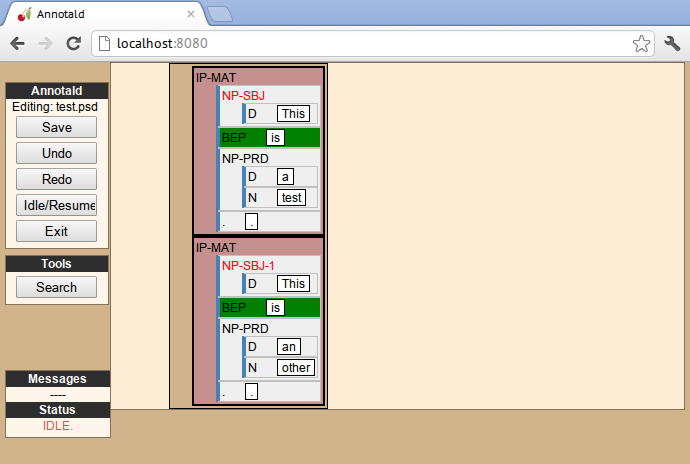

Users who know how to write their own CSS rules may do so using the
<<colorcss,`colorCSS`>> functionality.  Annotald maintains the label of
a node as part of the CSS class attribute.  You will probably need to
write fairly complex selectors for this; see the source for the
`style(Dash)Tag` functions for inspiration.

[[pythonsettings]]
==== Python settings

In this section, the settings specifiable in a `settings.py` file will
be discussed.

`extraJavascripts`:: The path to additional javascript files to be
included in the page.  This is relevant if for advanced users who are
writing their own <<customjs,javascript functions>> and would like to include external libraries.

`debugJs`:: Include debugger-friendly versions of javascript files in
the page.  Only Annotald developers need to set this; for users the
default value `False` is appropriate.

`colorCSS` [[colorcss]]:: Whether to use a user-supplied CSS file.

`colorCSSPath`:: The path to the user-supplied CSS file.

`rewriteIndices` [[rewriteindices]]:: By default, Annotald normalizes the indices of files
when saving.  Thus, if you split a sentence into two root-level clauses,
the indices in the second clause will begin at 1 and count up
monotonically, even though they may have been originally higher by
virtue of having been split from later in another clause.  If you do not
want this behavior, set this variable to `False`.

`validators`:: See the <<externalvalidation,section on external
validation>> for information on this option.

`serverMode`:: By default, Annotald starts up in “server mode,” which
presents you with a checkpoint before opening a file.  This is to avoid
mishaps when Annotald is used in a multi-user environment.  In order to
disable this, set this variable to `False`.

[[keycmds]]
=== Default keybindings

The Annotald keybindings provided by default are adapted from those used
by the IcePaHC project.  It is highly recommended that users make a copy
of this file in the working directory for their corpus, and customize it
to their needs.  The procedure to do so is described in the following
section.  The default keybindings are as follows (from left to
right and top to bottom of a US keyboard layout):footnote:[To see an
exact listing of the tags included in each category described below, you
should consult the configuration file itself.]

Backquote (`):: Toggle the display of lemmata on or off

1:: Unbound

2:: Cycle between tags for non-argument NPs

@ (Shift-2):: <<splitWord,Split a word>>

3:: Unbound

4:: Toggle the =-PRN= dash tag (parentheticals)

5:: Toggle the =-SPE= dash tag (direct speech)

Q:: Cycle between tags for miscellaneous phrase types

W:: Cycle between tags for argumental NPs

E:: Cycle between tags for miscellaneous CPs

R:: Cycle between tags for relative clauses

T:: Cycle between tags for that-clauses and other types of CP

A:: Add a leaf after the selected node

S:: Cycle between tags for different types of sentential IP

D:: Delete a node

F:: Cycle between tags for PPs and ADVPs

G:: Cycle between tags for ADJPs and QPs

Z:: Undo

X:: Create a new node (labeled XP)

C:: Coindex nodes

Shift + C:: Toggle <<collapsing-nodes,collapsing>> of a node

V:: Cycle between tags for non-sentential IPs

Spacebar:: Clear the selection

L:: Edit the Label and/or text of a node

Shift + L:: The same (included as an example of a keybinding with
modifier)
Forward slash (/):: <<search,Search>>

[[customkeys]]
=== Custom keybindings

It is virtually certain that users will want to adapt the default key
bindings, to adapt the tags used and the most common use patterns of the
annotators.  It is possible to merely change the specific tags used
while maintaining the default conceptual categories (argumental NP,
non-sentential IP, etc.); it is also possible to come up with an
entirely new scheme.  The default bindings do not use the shift or
control modifiers, which opens up a large space of additional keys for
user customization.

The keybindings of Annotald are customized by placing calls to the
`addCommand` function inside the `customCommands` block.  This function
has 2 required arguments; any further arguments are determined by the
command being bound.  The first argument to the function should be a
Javascript dictionary (also known as an object).  This has the format
`{key: value, key2: value2}`.  The following keys are recognized:

- `keycode` the numeric Javascript keycode of the key you wish to bind.
  You can navigate to
  http://www.asquare.net/javascript/tests/KeyCode.html[this website] to
  determine interactively the code for any key on your keyboard.  Be
  sure to use the “keypress” code, not the “keydown” or “keyup” ones.
- `ctrl` the value `true` if this binding is for a shortcut with the
  control key pressed.  Ergonomically, it is much easier to actuate such
  shortcuts if you remap the “Caps Lock” key on your keyboard to
  control, so that it can be pressed with the pinky without needing to
  reach very far.  A panoply of methods to do so are presented at
  http://emacswiki.org/emacs/MovingTheCtrlKey[this website].
- `shift` the value true if this binding is for a shortcut with the
  shift key pressed.

The `ctrl` and `shift` options are mutually exclusive.

The second argument to the `addCommand` function is the name of the
function which the key will be bound to.  Any further arguments will be
passed to the function given.  A list of functions provided by Annotald
follows:

`clearSelection`:: Remove any selected node(s).  No arguments.

`coIndex`:: Various effects related to the numeric suffixes that
indicate movement/coreference/etc. chains:
- If called with only one node selected: remove this node’s numeric
  index.
- If called with two nodes selected, only one of which has an index:
  add an index matching the indexed node to the non-indexed node.
- If called with two nodes selected, neither of which has an index: add
  matching indices to both nodes.
- If called with two nodes selected whose indices match: cycle through
  different index types.  The cycle is: regular indices (both indices
  appended with `-`) -> gapping (first index appended with `=`) ->
  backwards gaping (second index appended with `=`) -> double gapping
  (both indices appended with `=`) -> remove indices.

+
No arguments.

`editNode` [[displayRename]]:: Edit the text of the currently selected
node.  If this is a non-terminal, edit its label.  If this is a
terminal, allow editing its label, lemma (if present) and text (iff the
text is an “empty element” – trace, comment, etc.)  This function
handles <<commenttypes-vars,comment nodes>> specially, as shown below.
No arguments.

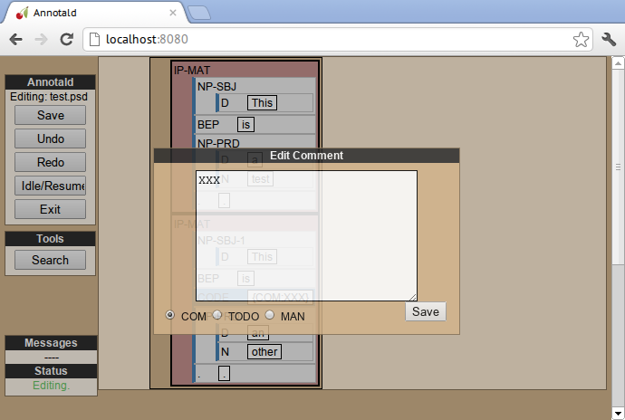

`leafAfter`, `leafBefore`:: [[leafBefore]] [[leafAfter]] Create a leaf node
after or before the (first-)selected node.  A heuristic is used to
determine the type of node to create.  If only one node is selected, the
default is to create an empty conjoined subject (i.e. =(NP-SBJ \*con*)=)
If there are two nodes selected, the second-selected node determines the
type of leaf to make.  If this node is:
- a wh-phrase (label begins with =W=), a wh-trace (=\*T*=) is created
- a clitic (label contains the dash tag =CL=), a clitic trace (=\*CL*=)
  is created
- otherwise, an extraposition trace (=\*ICH*=) is created

+
The label of the created node in these cases is determined by the label
of the second-selected node.  Generally, the label of that node is
copied, except:
- in the case of a wh-trace, the leading =W= is stripped (so the trace
  of a =WNP= is an =NP=, etc.)
- in the case of a clitic trace, the =CL= dash tag is stripped and =PRO=
  is transformed to =NP= (so the trace of =PRO-CL= is an =NP=, and the trace
  of =ADVP-CL= is =ADVP=).
+
Additionally, the trace and its antecedent (the second-selected node)
are coindexed.  No arguments.

`makeNode`:: Create a new node dominating the selected node,
or the span between the two selected nodes (inclusive).  This function
takes an optional argument specifying the label of the node to create;
if not present, the label of the new node will be “XP”.  One optional argument.

`pruneNode`:: Delete the selected node.  If a non-terminal node is
selected, the operation always succeeds, and the daughters of the
deleted node become daughters of the deleted node’s parent.  If a
terminal node is selected, the operation can succeed only if the node is
<<emptyelements,empty of textual content>>.  No arguments.

`setLabel`:: Set the label of the selected node.  The argument must be a
list of labels.  If the node’s current label is not present in the list,
it is set to the first entry in the list.  Otherwise, it is set to the
node immediately following its current label in the list (wrapping
around at the end of the list).  To illustrate, if the “f” key is bound
to `setLabel` with an argument of `["FOO","BAR"]`, selecting a node with
label “QUUX” and pressing the “f” key sequentially will yield:
1. the label being set to =FOO= (since “QUUX” is not in the provided
   list)
2. the label being set to =BAR= (since “BAR” follows “FOO” in the list)
3. the label being set to =FOO= (since “BAR” is at the end of the list,
   wrap to the beginning)
4. etc.

+
One argument.

[[splitWord]] `splitWord`:: Split a word (for example, to break up a
contraction).  Annotald will display a dialog box with the text of the
selected leaf.  You should enter an “@” (at-sign) at the location where
the words should be split.  Annotald will then create two leaves, one
containing the text to the left of the “@” and one the text to the
right.  Annotald adds =@= to the beginning or end of the resulting
leaves, to indicate that a splitting operation has taken place.

`toggleExtension`:: Toggle a dash tag on the selected node.  If the (first)
argument exists as a dash tag on the node, remove it.  Otherwise, add it.
The optional second argument gives a list of extensions in the order they
should appear from the base category out; if not given, it is filled from
one of <<extensions-vars,the `extensions`-family variables>> based on a
heuristic as to the type of node which is selected.  One mandatory and one
optional argument.

`toggleLemmata`:: Toggle whether lemmata are shown or hidden in the
UI.  No arguments.

`undo`/`redo`:: Undo the most recent editing operations, or redo after
undoing something.  No arguments.

== Additional features

This section addresses Annotald features that, while not necessary for
annotation, can be convenient in certain circumstances.  Generally
speaking, the features in this section do not require any programming in
order to be useful.  Features which do require programming are discussed
in the <<advanced-features,next section>>

[[limiteddisplay]]
=== Limited display
Annotald supports showing only a limited number of trees at a time in
the browser interface.  Some people find that annotating in this manner
feels more natural.  In order to activate this feature, pass the `-n`
command line option to Annotald, followed by a number indicating how
many trees to show at a time.  As a shortcut for `-n 1`, you can also
use `-1` (in both cases, the last character is the numeral one).

When this mode is active, Annotald will have a “previous tree,” “next
tree,” and “goto tree” button; the latter of which operates based on the
index shown in the left-hand menu.  This appears as in the following
screenshot:footnote:[The screenshot is somewhat cramped, owing to the
artificially small size of the window.  When working with the interface
at full-screen size, the interface will be less crowded.]

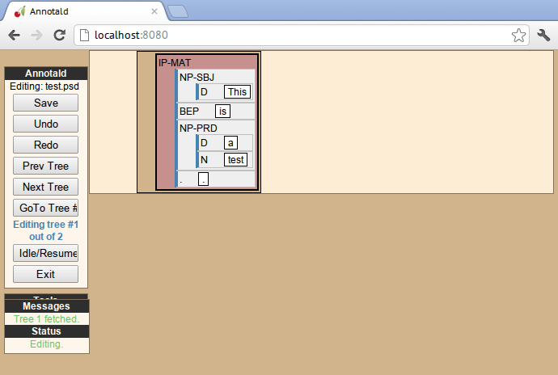

[[timelog]]
=== Event log

Annotald supports keeping a log of actions that you take in the program.
This log is stored in a non-user-readable file called
`annotaldLog.shelve` in the directory from which Annotald is
invoked.footnote:[This file is in the format used by the `shelve` Python
library.  Interested users may consult
http://docs.python.org/library/shelve.html[the module’s documentation]
and Annotald’s source code if they desire to create custom code to
analyze the log.]  There are three levels of logging possible:

// TODO(post-1.0): ideally this table would be centered, but adoc ->
// docbook doesn’t center things

[options="header",cols="s,2*1^"]
|====
| Type                   | <<cmdline-q,Command line flag>> | <<logdetail,`logDetail`>>
| no logging             | `-q`                            | N/A
| major event logging    | none                            | `false`
| full logging           | none                            | `true`
|====

The “major event logging” setting records when the program is opened and
closed, as well as when the file is validated or saved.  That is, it
records events visible to the Annotald server.  It does not record any
actions taken in the browser.  Full logging, on the other hand, records
clicks.

Each event has associated with it a timestamp, which is recorded as
seconds since the https://en.wikipedia.org/wiki/Unix_time[Unix epoch].
Currently, the only way to analyze this data is by <<csv-log,converting
it to CSV format>> and importing it into another analysis program such
as http://www.r-project.org/[R].  In the future, Annotald will offer
built-in ways of generating reports from this data, such as how much
annotation time has been spent on each file, or (with full logging
enabled) which keys are most often pressed.

[[casemenu]]
=== Case menu

Annotald includes support for manipulating case marking information in
corpora which store that information in a supported format.  In order to
be supported, the case must:footnote:[The YCOE does not follow these
guidelines.  Case is marked on phrasal nodes with dash tags (as a
substitute for grammatical role marking: =SBJ= etc.), and on words with
a caret: =^N= for nominative etc.  The Penn parsed corpora of Middle
English and later time periods indicate genitive with a =$= which is
directly concatenated with a leaf’s label, but this is not the kind of
case-marking that this Annotald feature addresses.  The IcePaHC corpus
does obey these conditions (unsurprisingly, since Annotald comes from
that project), as does the Penn Parsed Corpus of Historical Greek.]

- be stored as dash tags,
- at the word level,
- without any unmarked default categories.

Then, <<casevars,some options>> need to be set in the configuration
file.  Once this is done, the context menu will contain options for
setting case:

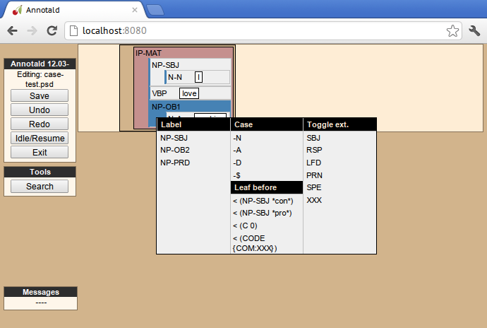

Invoking the context menu on an individual case-bearing node (one of
<<casevars,`caseTags`>>) will allow that node’s case to be changed
individually.  Invoking it on a case-bearing phrase (one of
<<casevars,`casePhrases`>>) will change the case of all that node’s
case-bearing daughters, without recursing too deeply.

[[search]]
=== Searching

Annotald has a structural search engine built in.  While it cannot
replicate the flexibility or (perhaps especially) speed of a dedicated
search program such as
http://corpussearch.sourceforge.net/[CorpusSearch], it is useful to be
able to search within the Annotald interface itself.  The search dialog
is accessed by clicking the “Search” button in the Tools menu, or by
pressing the forward slash (`/`) key.  Within the dialog box, you will
construct a visual representation of your query, similar to the
representation of trees in the Annotald interface.

The simplest query tree contains only one leaf node.  The leaf has a
text box, into which the search string can be entered.  The string is
interpreted as a case-insensitive Javascript regular expression.  The
Javascript regular expression format is very similar to that used by
many programming languages.  A full description of the format is outside
the scope of this document, but is available via
https://developer.mozilla.org/en-US/docs/JavaScript/Reference/Global_Objects/RegExp[this
reference manual].  The leaf also has a drop-down box, which indicates
whether the search string is to match against the node labels, the text
of the corpus, or the lemmata.  The search string is additionally
left-anchored – that is, the beginning of the regular expression is
constrained to match the beginning of a node label or word.  Pressing
the “Search” button will execute the search.  Matches will be
highlighted with a yellow box, and the document will be scrolled to
display the next match.  A very simple query and its result is
illustrated in the following screenshots:

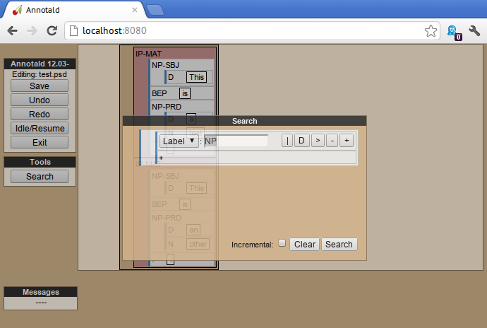

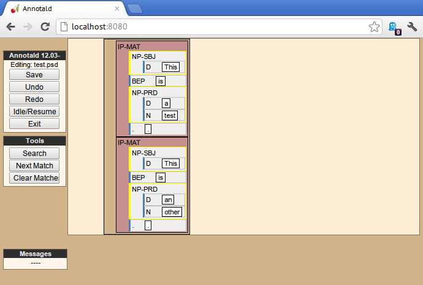

Once the search has completed, two buttons will appear below the
“Search” button.  The first of these scrolls the document down to
display the next match.  The second removes teh hithlighting from serach
matches.

In addition to the search node where text can be entered, there is a
node consisting only of a plus sign (“+”).  Clicking this node adds a
sister to the search node.  Search nodes which are sisters are
interpreted as the (unordered) sisterhood relation.  An example of such
a search is given in the following two screenshots:

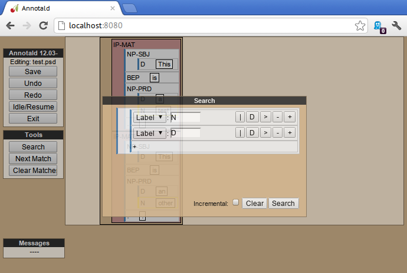

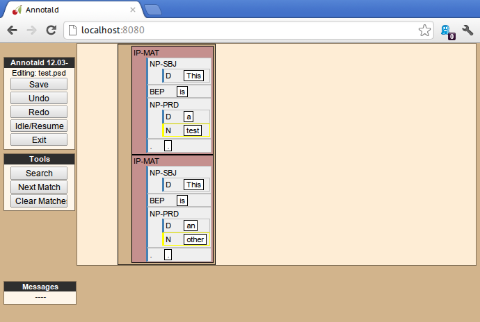

Each search node has some buttons in the upper-right hand corner.  From
left to right, these are:

// TODO: add screen shot examples to all of these

Or (vertical bar):: This creates an “OR” node as the parent of the node
from which it is clicked.  The daughters of an “OR” node are interpreted
disjunctively, instead of conjunctively (the default).  An example of
such a search is shown in the follwoing screenshots:footnote:[Note that
the results are the same as the previously illustrated sisterhood
search, though the queries are distinct.]

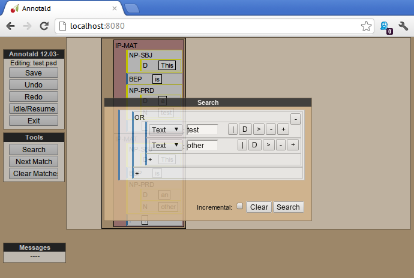

image::images/annotald-search-or-result.png["Results of a disjunctive Annotald search",align="center"]

Deep (“D”):: This creates a deep search node as a daughter of the node
from which it is clicked.  By default, child search nodes require direct
daughterhood.  The children of deep nodes, in contrast, can match at any
depth.

Precedes (“>”):: This creates a precedes node as a sister of the node from
which it is clicked.  By default, as mentioned above (and illustrated in
the screenshots), the sisterhood relation among search nodes in
interpreted without regard to directionality.  Precedes nodes, on the
other hand, impose a precedence relation on their daughter (whih is not
in fact interpreted as a daughter, but rather as a sister, of the
original node.)

Remove (“-”):: This removes the node from which it is clicked.  Any
daughters of this node are promoted to the node’s parent; if the node
has no daughters it simply disappears.

Add daughter (“+”):: This adds a daughter search node to the node from
which it is clicked.  The defaultinterpretation is direct daughterhood,
which can be changed by using a deep node, as already mentioned.

// TODO(dev): allow drag and drop of nodes?  or buttons to move them?

[[collapsing-nodes]]
=== Collapsing nodes

The hierarchy of a node may be collapsed, for example to facilitate the
editing of the clause-level structure in the presence of large amounts
of structure inside NPs.  When collapsed, a node’s text (including
traces and empty categories) is displayed in the node, separated by
spaces.  The syntactic labels inside the node are not displayed.  The
usual blue and grey colors of the node’s border are replaced by purple,
to indicate that collapsing is in effect.

// TODO: screenshot

[[advanced-features]]
== Advanced features

In this section, some advanced features of Annotald are described.
These are not required to use Annotald (and in fact are deactivated by
default).  However, for proficient users, their use may make possible
grater annotation efficiency and accuracy.  Generally speaking, all
features in this section require some faculty with programming, in the
broad sense of using an abstract language to give instructions to a
computer.

[[tagset-validate]]
=== Tagset validation

// TODO(dev): make sure that annotald uses this info everywhere it can.

By default, Annotald does not contain a mechanism to ensure that tags
created through editing conform to any sort of schema.  At the same
time, there are various parts of Annotald’s code that would benefit from
knowing whether a node corresponds to a leaf or not, which is not always
a purely structural decision (for example, a node of the form =(NP-SBJ
\*pro*)= is structurally a leaf, but in fact corresponds to a phrasal
node, an NP).  Supplying this information to Annotald improves its
functioning, as well as preventing nonsense tags from being added to the
corpus during editing.

You can do this however you like – the only requirement that Annotald
imposes is that you assign to the configuration variables `testValidLeafLabel`
and `testValidPhraseLabel` Javascript functions that return true iff its
argument is a valid label for a leaf node or phrase node
(respectively).  One useful way of doing this is described below.

It is possible to write a grammar to validate tags.  Just as the grammar
of a natrual language accepts only those sentences which are well-formed
in that language, this grammar should accept only the tags which are
valid in a particular corpus.  In particular, this manual will describe
how to use the http://waxeye.org/[Waxeye Parser Generator] to do so.  In
addition to being Free Software, this program uses a relatively
intuitive notation for its grammars.  Additionally, it can generate
grammars not only in Javascript, but also in Python and several other
computer languages.  This allows the same grammar specification to be
used in Annotald as well as in a validation script for the corpus.

Grammars written in waxeys consist of a series of rules.  The first rule
in the file constitutes the grammar – it must match.  A rule has the
form `name <- content`.  The name of a rule can consist of letters,
numbers, and underscores.  The content of the rule can be as follows:

- `'string'` matches string in the input, literally
- the name of another rule forces that rule to match
- `(...)` is a grouping construct
- `A B` matches A followed by B
- `A | B` matches either A or B
- `?A` matches maybe A – that is, if A matches, the parser’s input
  advances over it, but if A does not match, the parser does not fail.
- `*A` matches 0 or more A
- `+A` matches 1 or more A

Comments are enclosed in `/* ... */`.

Using these rules, it is possible to build up a grammar.  As an
illustration, here is a grammar that matches
http://www.ling.upenn.edu/histcorpora/annotation/labels.htm#pos_tags[the
tagset from the PPCEME] (without, for simplicity, the numbered word splitting).

// TODO: test this

----------
word_tag <-
/* <1> */
 ( verbal | nominal | punct | other_word | fn_cat )

nominal <-
/*       <2>      <3> */
 ('NUM' ?'$') | ('N' ?'PR' ?'S' ?'$') | ('ADJ' ?('R' | 'S')) | 'D' |
 ('PRO' ?'$') | ('Q' ?('R' | 'S' | '$'))

verbal <-
 verb | verb_modifier

verb <-
/* <4> */
 (('DO' | 'BE' | 'HV' | 'VB') ?('D' | 'P' | 'N' | 'I')) |
 (('D' | 'B' | 'H' | 'V') 'A' ('G' | 'N')) |
 ('MD' ?'0')

verb_modifier <-
 ('ADV' ?('R' | 'S')) | 'NEG'

punct <-
/* <5> */
 '\'' | '"' |',' | '.' | '`'

fn_cat <-
 'C' | 'CONJ' | 'P' | ('W' ('ADV' | 'D' | ('PRO' ?'$'))) |
 'INTJ' | 'ALSO' | 'ELSE' | 'EX' | 'FP' | 'RP' | 'LB' | 'LS' |
 'MAN' | 'ONE' | ('OTHER' ?'S' ?'$') | 'SUCH' | 'TO' | 'WARD'

other_word <-
 'CODE' | 'FW' | 'X' | 'FP' | 'META'
----------

<1> For simplicity, the first rule is divided into a disjunction of
different sub-rules.

<2> This is a very simple example of a rule – the =NUM= tag may be
followed by an optional =$=, indicating that it is possessive

<3> A more complicated rule.  A noun =N= may be proper =PR=, plural =S=,
and/or possessive =$=.  Any subest of these modifiers may appear.

<4> The most complicated rule in this grammar.  A verbal tag consists of
an indicator of the verb’s lexical identity (_do_, _be_, _have_, or
other), followed by an indicator of its form.  Present =P=, past =D=,
past participle =N=, and imperative =I= follow a two-letter verb code,
giving rise to forms like =DOD=, =BEP=, etc.  Present participle =G= and
passive participle =N= follow a one-letter code followed by =A=, giving
rise to =VAN=, =HAG=, etc.

<5> Because `'` is the quote character, to obtain a literal quote
character it must be backslash-escaped.

// TODO: num before n
// TODO: matching dashes in phrasal rules

[[externalvalidation]]
=== External validation

Annotald includes a feature that allows the user to interactively submit
the contents of a file to a separate program, and receive feedback from
that program.  This system is (intentionally) very powerful – the
external program can be any Python function,footnote:[Which in turn may
invoke any program on the user’s computer] and the feedback comes in the
form of that function modifying the file contents; these modified file
contents replace the original file in the Annotald interface.  It is
hoped that this flexibility will facilitate a wide variety of automated
workflows.

NOTE: This feature presently causes all undo history to be erased when
the file is sent for validation.
// TODO(dev): we could instead record the validation as a single undo
// step.  Drawback: undoing past the validate will erase the validation
// also.  Which is worse?

One conventionalized way of using this facility is to perform
_validation queries_ on the file – queries that will find anomalous
structures, and flag them for annotator attnetion.footnote:[This idea
stems from discussions with Beatrice Santorini about how her parsing
methodology.]  In this section, we will discuss setting up such a
system, using CorpusSearch queries.

The specification of validation queries involves customizing the Python
settings file.  An annotated example of such a file is given immediately
below.

[source,python]
----------
import os.path
current_dir = os.path.dirname(os.path.abspath(__file__)) # <1>

from collections import OrderedDict # <2>

validators = OrderedDict([
    ("Example 1", corpusSearchValidate(current_dir + "/example1.q")), # <3>
    ("Example 2", corpusSearchValidate(current_dir + "/example2.q"))
])
----------

<1> An easy way to find in Python other necessary files (in this case,
CorpusSearch queries) is by locating them with relation to the Python
file itself.  This line assigns the directory where the script is
located (as a string) to the variable `current_dir`.  Thus, this code
assumes that in the same directory as the `settings.py` file, there are
two files named `example1.q` and `example2.q` containing relevant
CorpusSearch queries.
// TODO(dev): could we simplify things, by using a decorator to add a
// name to fns, and then just using a list of fns?
<2> The format of the `validators` variable is a dictionary – a data
structure that associates keys (in this case, human-readable names of
validators) with values (validation functions).  The default dictionary
implementation in Python does not preserve the order of the key-value
pairs it stores.  This line allows us to use an alternative
implementation that does preserve this order.  This means that the order
which we specify validators in this file will be the order that they
appear in Annotald’s dropdown menu.
<3> We create an `OrderedDict` object, and assign it to the `validators`
variable.  Each entry in the dictionary is given as a pair of `(key,
value)`.

The `corpusSearchValidate` function takes one argument, giving the path
to a CorpusSearch query file.  It then arranges to run this query on the
file, and return the modified output.  The CorpusSearch program is
distributed with Annotald; however, this facility relies on a Java
executable being installed on your machine.  You can test this by
opening a command prompt and typing `java` followed by a carriage
return.  You should see a usage message from the java program; if you
instead receive an error message the java program is not installed
and/or accessible.

By convention, the validator should add the =-FLAG= dash tag to
trees which are anomalous.  The “Next Error” button in the Annotald
interface will allow you to jump to the next flagged tree in the
file.  You can also attach a keybinding to the `nextValidationError`
function, if you would like to use the keyboard for this purpose.
The program removes any =-FLAG=s when the file is saved and when
submitting it to the validator.

When validators are specified, the Annotald interface shows the
“Validate” and “Next Error” buttons as well as the validator selection
menu in the “Tools” section of the left-hand column, as shown in the
below image:

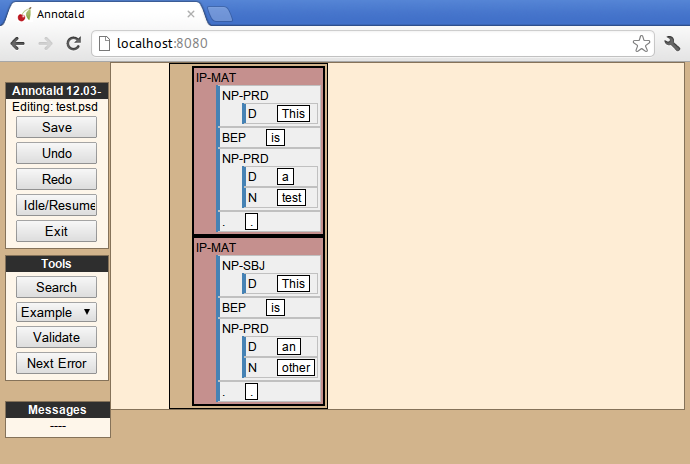

The example given above assumes that two CorpusSearch query functions
are present in the same directory as the Python file.  For more
information about writing CorpusSearch queries, consult the
http://corpussearch.sourceforge.net/CS-manual/Contents.html[user’s
guide], esepcially (for present purposes) the
http://corpussearch.sourceforge.net/CS-manual/Revise.html[section on
automated corpus revision] which tells how to make changes to the
input.  As an example, the following CorpusSearch revision query adds a
=-FLAG= to all NPs:

----------
node: $ROOT

query: {1}NP* exists

append_label{1}: -FLAG
----------

If run in the Annotald interface, it produces this result:

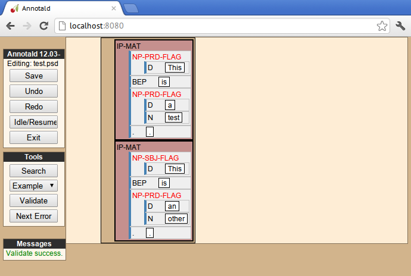

[[customjs]]
=== Custom Javascript

Because the `settings.js` file is interpreted as unrestricted Javascript
in the Annotald UI, it can be the vehicle for powerful customizations.
Annotald includes the http://jquery.com/[jQuery] and
http://underscorejs.org/[Underscore.js] libraries, meaning that you can
use functions from either of these libraries in customization code.  The
details of these libraries are beyond the scope of the current document.
As an overview, Annotald maps nodes in a parsed file to nodes in the
DOM.  Using jQuery’s DOM manipulation functions (which are what Annotald
itself uses internally), it is possible to create custom functions that
are powerful and mnemonic.

For more information on Annotald’s API, consult
http://annotald.github.com/api-doc/global.html[the API documentation].

What follows is an annotated example of a custom function.  It forms a
=CONJP= semi-automatically.  Specifically:

- if two nodes are selected, create a word-level conjunction spanning
  the selection; give it the label of the first selected node
- if one node is selected, look for a =CONJ= daughter of the selected
  node.  The nodes before the =CONJ= and after it are wrapped in an
  extra layer of structure; a =CONJP= is inserted dominating the =CONJ=
  and the second conjunct

[source,javascript]
----------
function autoConjoin() {
    if (!startnode) return; // <1>
    if (!endnode) { // <2>
        var savestartnode = startnode;
        var selnode = $(startnode); // <3>
        var label = getLabel(selnode);
        if (!label.startsWith("IP") &&
            !label.startsWith("CP")) { // <4>
            label = label.split("-")[0];
        }
        var conjnode = selnode.children(".CONJ").first(); // <5>
        if (conjnode) {
            startnode = selnode.children().first().get(0); // <6>
            endnode = conjnode.prev().get(0);
            makeNode(label);
            startnode = conjnode.get(0);
            endnode = selnode.children().last().get(0);
            makeNode("CONJP");
            var conjpnode = $(startnode);
            startnode = conjpnode.children().get(1);
            endnode = conjpnode.children().last().get(0);
            makeNode(label);
            startnode = savestartnode; // <7>
            endnode = undefined;
            updateSelection();
        }
    } else { // <8>
        var s = $(startnode);
        var l = getLabel(s);
        if (s.nextUntil(endnode).filter(".CONJ").size() > 0 && // <9>
            s.end().children().filter(function () {
                return !guessLeafNode($(this));
            }).size() == 0) {
            makeNode(l);
        }
    }
}
----------

<1> Exit the function if nothing is selected.
<2> If `endnode` is `null`, there is only one node selected.
<3> The `startnode` and `endnode` variables hold “native” nodes.  The
`$()` function “wraps” them in the jQuery library, allowing jQuery
functions to be used.
<4> IP and CP nodes should keep their dash tags when embedded inside
conjunction.  Thus we have (e.g. in the PPCEME) =(NP-SBJ (NP ...)
(CONJP ...))= but =(IP-INF (IP-INF ...) (CONJP ...))=
<5> jQuery syntax is very intuitive; this line gets the first child of
the `selnode` (selected node)
<6> Appending `.get(0)` to a jQuery object “unwraps” it, transforming it
back to a native type appropriate for storing in the `startnode`
variable.
<7> Restore the user’s selection before exiting the function
<8> This is the branch that will be taken if two nodes are selected
<9> For word level conjunction, the selection must span over a =CONJ=
node, and each member of the selection must be a leaf node.

// Things to talk about:
// - annotation philosophy (useful annotation vs. correct annotation, some
//   of beatrices ideas, etc)
// - the annotation itself (building up from nps to pps to verbs to
//   sentences/clauses)
// - extensions (morpho/semantic information, lemmatization, ...)
// - tagset design etc.

// corpus formats – old, dash, and deep

// what else???

== Auxiliary commands

Annotald comes with a command-line tool that performs some auxiliary
functions.  It is invoked at the command line by typing `annotald-aux`,
followed by the name of an auxiliary command, followed by that command’s
arguments.  Unless otherwise indicated, commands that operate on a file
modify the file in place.  If you want to preserve an unmodified version
of the file, make sure to make a copy before invoking
`annotald-aux`.footnote:[You can also use another means of recording the
prior state of the file, of course, such as checking it into a version
control system.]  The available commands are:

`convert`:: Convert a file from another format into Annotald’ output
format.  Currently, this command supports converting from CorpusSearch
output files, via the `-o` option followed by a filename argument.
Supplying this option will strip CorpusSearch (and emacs parser-mode)
comments from the file.  The file will additionally have its trees
reindented.  You can have reindentation alone by invoking the command
with only a filename argument (no `-o`).

`check-trees`:: Check each tree in the file to make sure it is valid.
When working with non-structural editing methods(such as hand-editing or
regular expressions), it is somewhat common for a parenthesis to go
astray, leading to an invalid tree.  This mode will help you find such
mistakes.  It does not modify its argument file.

`csv-log` [[csv-log]]:: Convert the <<timelog,Annotald event log>> to
CSV format, appropriate for analysis in an external program.

`hash-file`:: This command adds a hash to the file.  A hash is a
“fingerprint” of the file’s text.  Annotald will not allow you to change
the text of the corpus, and if a file has a hash, it will verify, on
every save, that the corpus text has not changed.  Hashing files is good
protection against possible Annotald bugs, as well as against
modifications to the file’s text arising from other editing methods.
+
Annotald contains a built-in feature for <<splitWord,splitting words>>, and splits
will not be counted as changes to the text.  However, if you edit the
text by hand (for example to join words, which Annotald does not
support natively), you will need to re-hash the file.

`rewrite-indices`:: In editing trees, the movement indices can become
disjointed.  For example, splitting a sentence in two can result in a
sentence whose indices begin at a number larger than one.  Using this
command sequentially renumbers all indices in all trees, beginning with
1 for each tree and proceeding in order.
+
Annotald will additionally rewrite indices automatically on save, unless
this feature is <<rewriteindices,disabled>> in the `settings.py` file.

`cat-settings-js`, `cat-settings-py`:: These commands write a copy of
the default Javascript or Python settings files to standard output.

`reindent`:: Passed the name of a file as an argument, this command will
reindent the trees in the file so that sisters on the same level have
the same amount of preceding horizontal whitespace.

[appendix]
== Annotald file format

Annotald understands files in the Penn treebank format.  The following
is a description of the file format, as implemented by Annotald.  In
this description, the word “must” should be interpreted to mean that
Annotald’s behavior on files not fulfilling the given restriction is
undefined, and quite possibly buggy.  “Should” introduces prescriptions
that, while best practices for ensuring full stability, may not be
necessary for Annotald to function properly.

Annotald’s input files must consist of UTF-8 encoded text.  (If you do
not use any diacritics or non-English letters, UTF-8 encoding is
equivalent to using ASCII, which is the default text format on all
platforms.)  They should have the file extension `.psd`.  The contents
of the file must be a list of trees (defined below), each separated from
the next by two newline characters.  (If you have the option, choose
“Unix” line endings, as opposed to “Mac” or “Windows” when saving the
files in a text editor).

A tree must contain a balanced number of opening parentheses =(= and
closing parentheses =)=.  The outermost set of parentheses encloses:

- the tree itself
- an optional ID node
// TODO: metadata

Uniquely, the outermost set of parentheses has no label.

The ID, if present, must be a leaf node, with label =ID= and text as
described below.
// TODO

The tree must be any node.  A node must be either a leaf node or a
branching node.  A leaf node must have the format =(LABEL text)=.  The
label should consist of capital letters of the English alphabet, A–Z.
Often, the label is a word’s POS tag.  The text can be an arbitrary
non-empty string, except it must not contain =(= or =)= characters.

A branching node must have the following format: =(LABEL <node> ...)=.
The label must be formatted as above.  The remainder of the content of a
branching node must be a sequence of one or more nodes, separated by
arbitrary whitespace.

Annotald imposes a particular indentation scheme on files it writes, but
whitespace generally speaking does not affect its interpretation of
input files, except that trees must be separated by exactly two
newlines.

=== Mapping from source document to corpus representation

In general, the text of leaf nodes in the file should correspond as
closely as possible to the text of the original document being parsed.
This maximizes the reproducibility and perspicuity of the parsing
process in several ways:

- Any passages with questionable text can be cross-checked with the
  original source document.
- The original text provides a base against which different parsing
  standards can be compared
- Any interpolation done by the annotator is made explicit, as described
  below.

With the following exceptions, the text of every node should represent
an orthographic word (for the rest of this section, a “word”) from the
original document.

- Sometimes, a word must be split so that its parts can be given
  different annotation.  Annotald contains <<splitWord,a facility for
  splitting words in a consistent and reversible way>>.
- Sometimes, it is beneficial to insert comments into the text.
  Annotald reserves the =CODE= label for leaf nodes whose text should be
  interpreted as a comment.  There is a <<displayRename,facility for
  editing and distinguishing different comments>>.
- [[emptyelements]] Most annotation schemes include some kinds of traces
  and empty elements.  The rules for these are:
  * Any node with the text exactly =0= will be considered an empty
    operator.  If the source text contains “0” as an orthographic word,
    your annotation scheme should specify a canonical replacement (such
    as =<zero>=).
  * Any node with the following text as the beginning of its text
    string will be considered a trace:
    +
    [horizontal]
    `*`:: An A-movement trace
    `*T*`:: An A-bar movement trace
    `*CL*`:: A clitic movement trace
    `*ICH*`:: A trace of rightward movement or extraposition (mnemonic:
    Interpret Constituent Here)

//  LocalWords:  Annotald extraposition clitic whitespace

// Local Variables:
// outline-regexp: "=+ "
// End:
